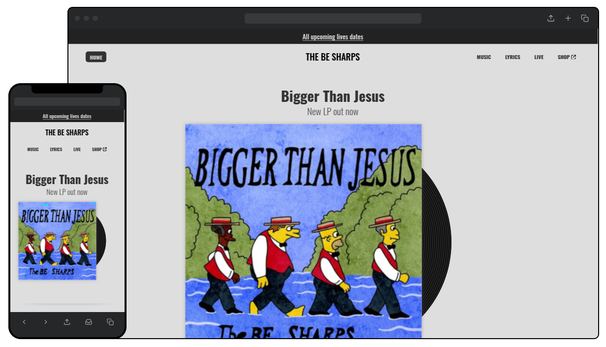

# Skene

Part of the [Gonzo Engineering](https://gonzo.engineering) project, Skene is a template intended to empower musicians to create unique, independent online presences.

Music, gigs, and artist details input through the content management dashboard automatically generates a rich, SEO-optimised website that belongs to you. No third party platforms, no fees, just a digital home for your music life.

Think the [Neil Young Archives](https://neilyoungarchives.com/), but for everyone.

## The template

Out of the box Skene sites should look a little like this:

You can browse a live example of the template [here](https://gonzo-skene-template.netlify.app/).

Features include:

- **An in-depthm interlinked music directory** with release types, credits, lyrics, and video embeds
- **Live performance listings** to let fans know when you're playing, where, and how to buy tickets
- **Open source, privacy-friendly analytics integration** courtesy of [GoatCounter](https://www.goatcounter.com/)

All of this is a base that can and should be edited, customised, and personalised to your heart's content.

The Skene concept is currently powering...

- [thomasashby.co.uk](https://thomasashby.co.uk)
- [boness.art](https://boness.art)

More to come, hopefully.

## Why?

Maintaining a website takes time and money, both of which musicians would rather be spending on their music. Third party platforms offer limited control and customisation, with some subscriptions amounting to hefty sums over time.

The idea with Skene is that if essential info - artist details, releases, lyrics, gigs, etc. - is turned into data, that data can be used to generate rich, immersive websites, giving artists fully customisable spaces of their own on the web.

## Setup

Getting a Skene site up and running should take more than five minutes. That's the aspiration anyway.

1. Use this template to create a new repository. You'll need a GitHub account for this
2. Create or log into a [Netlify](https://www.netlify.com/) account and [set up deployment](https://docs.netlify.com/site-deploys/create-deploys/) for the new repository, linking a custom domain if you wish
3. Activate [Netlify Identity](https://docs.netlify.com/security/secure-access-to-sites/identity/) in the Netlify site configuration, enable Git Gateway, and invite your email to be a user
4. Once you've set up your user password, go to the /admin page of your site, log in, and start making it yours!

With that you should have a fully fledged website costing no more than whatever you're paying for your domain name.
